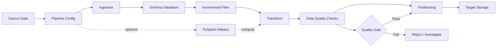

# Data Engineering Toolkit

A lightweight, production-minded Python toolkit for building reliable metadata-driven data pipelines.

The project packages reusable patterns commonly needed in batch and near-real-time data platforms: configuration-driven ingestion, schema validation, data-quality checks, incremental processing, partition management, retries, and optional PySpark helpers.

## What it provides

- **Metadata-driven configuration** with YAML.
- **Schema validation** for required columns and basic Python types.
- **Data-quality checks** for nulls and uniqueness with structured reports.
- **Incremental processing** through an explicit watermark abstraction.
- **Partition helpers** for Hive-style date partitions.
- **Retry utilities** with bounded exponential backoff.
- **Optional PySpark support** without making Spark a core dependency.
- **Tests + GitHub Actions CI** for repeatable validation.

## End-to-end flow

The toolkit is designed around a simple pipeline lifecycle:



### Component view

```text
                    +----------------------+
                    |   YAML Metadata      |
                    | pipeline + quality   |
                    +----------+-----------+
                               |
                               v
+-------------+      +---------+----------+
| Source Data | ---> |     Ingestion      |
+-------------+      +---------+----------+
                               |
                               v
                    +----------+-----------+
                    | Schema Validation    |
                    +----------+-----------+
                               |
                               v
                    +----------+-----------+
                    | Incremental Filter   |
                    |    (watermark)      |
                    +----------+-----------+
                               |
                               v
                    +----------+-----------+
                    |     Transform        |
                    |  Python / PySpark    |
                    +----------+-----------+
                               |
                               v
                    +----------+-----------+
                    | Data Quality Checks  |
                    | null + uniqueness    |
                    +----------+-----------+
                               |
                    +----------+-----------+
                    |    Quality Gate      |
                    +-----+-----------+---+
                          |           |
                       pass         fail
                          |           |
                          v           v
                  +-------+----+   Reject/
                  | Partition  |   Investigate
                  | path helper|
                  +-------+----+
                          |
                          v
                  +-------+------+
                  | Target Store |
                  +--------------+
```

## Repository structure

```text
data-engineering-toolkit/
├── data_engineering_toolkit/
│   ├── config/           # YAML configuration loading
│   ├── etl/              # Incremental + partitioning helpers
│   ├── quality/          # Schema + data-quality checks
│   ├── spark/            # Optional PySpark helpers
│   └── utils/            # Shared utilities such as retry
├── examples/             # Runnable configuration + example pipeline
├── tests/                # Unit tests
├── .github/workflows/    # CI
├── pyproject.toml
├── LICENSE
└── README.md
```

## Quick start

```bash
python -m venv .venv
source .venv/bin/activate
pip install -e '.[dev]'
pytest
```

Run the example:

```bash
python examples/run_pipeline.py
```

Expected output:

```text
pipeline=orders_daily
schema_passed=True
quality_passed=True
```

## Configuration example

```yaml
pipeline:
  name: orders_daily
  source: s3://example/raw/orders/
  target: s3://example/curated/orders/
  watermark_column: updated_at
  partition_columns:
    - event_date

quality:
  not_null:
    - order_id
    - updated_at
  unique:
    - order_id
```

## Design principles

1. **Configuration over hard-coded pipeline logic.**
2. **Fail fast on invalid schemas and critical quality failures.**
3. **Keep state explicit through watermarks/checkpoints.**
4. **Make storage and compute adapters replaceable.**
5. **Keep the core library cloud-agnostic while allowing AWS/Spark integration.**

## Roadmap

- Add object-store adapters for S3/GCS/Azure Blob.
- Add Great Expectations/Deequ-compatible quality adapters.
- Add Kafka/Kinesis ingestion examples.
- Add Delta Lake helpers.
- Add OpenTelemetry metrics and tracing.

## License

Apache-2.0. See [LICENSE](LICENSE).
